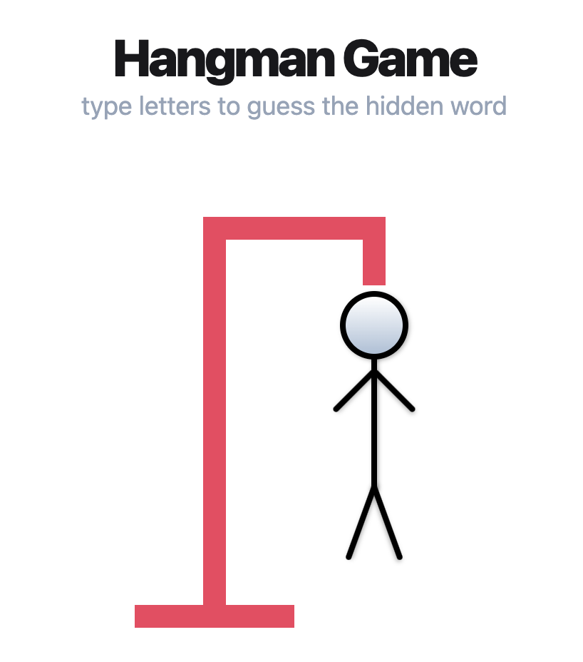

# Hangman Game

<p align="center"></p>

A JavaScript version of the classic hangman game where the player has 6 attempts to guess the hidden word.

## Implementation Details

This JavaScript game involves guessing a word, letter by letter. Players are able to type keyboard inputs for the letters and a visual representation of a hangman updates with each wrong guess.

The code is organized through different ES6 modules for utility functions, word-related operations, game logic and rendering. The game state is managed through an `STATE` object. The `ìnit` function initializes the game state, renders the game screen and adds event listeners for key presses.

The clean interface is designed using [Tailwind CSS](https://tailwindcss.com/). The game fetches a list of words from an external [Random Word API](https://random-word-api.herokuapp.com/all) using asynchronous requests. In case of an error, a default set of words is used.

## Usage

Import the `init` function from module from `./src/app.js`.

```js
<script type="module">import {init} from './src/app.js' init();</script>
```

Access the DOM references on utilities.js.

```js
const elementsIDS = {
  dashedID: 'dashed',
  wrongsID: 'wrongs',
  restartID: 'restart',
  headID: 'head',
  torsoID: 'torso',
  leftArmID: 'left-arm',
  rightArmID: 'right-arm',
  leftLegID: 'left-leg',
  rightLegID: 'right-leg',
};
```

## Development

Change into directory on the terminal and install with npm.

```bash
cd hangman-game
npm install
```

To run the application.

```bash
  npm run dev
```

## License

[MIT](https://choosealicense.com/licenses/mit/);
