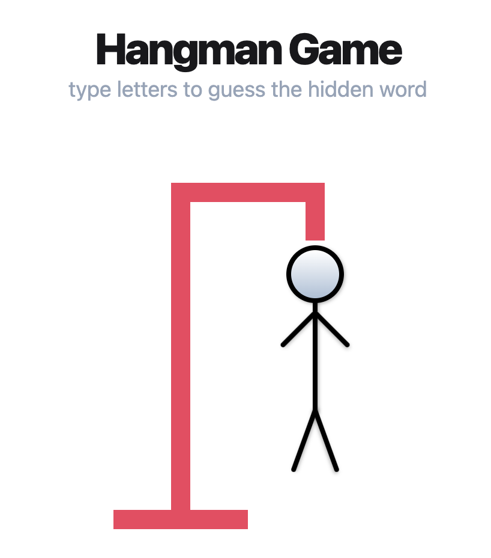

# Hangman Game

<p align="center"></p>

<div align="center">

<a href="">[](https://codesandbox.io/p/github/kevinsilva/hangman-game/master?import=true&layout=%257B%2522sidebarPanel%2522%253A%2522EXPLORER%2522%252C%2522rootPanelGroup%2522%253A%257B%2522direction%2522%253A%2522horizontal%2522%252C%2522contentType%2522%253A%2522UNKNOWN%2522%252C%2522type%2522%253A%2522PANEL_GROUP%2522%252C%2522id%2522%253A%2522ROOT_LAYOUT%2522%252C%2522panels%2522%253A%255B%257B%2522type%2522%253A%2522PANEL_GROUP%2522%252C%2522contentType%2522%253A%2522UNKNOWN%2522%252C%2522direction%2522%253A%2522vertical%2522%252C%2522id%2522%253A%2522clng7bykl00073b6iqip7s6x7%2522%252C%2522sizes%2522%253A%255B70%252C30%255D%252C%2522panels%2522%253A%255B%257B%2522type%2522%253A%2522PANEL_GROUP%2522%252C%2522contentType%2522%253A%2522EDITOR%2522%252C%2522direction%2522%253A%2522horizontal%2522%252C%2522id%2522%253A%2522EDITOR%2522%252C%2522panels%2522%253A%255B%257B%2522type%2522%253A%2522PANEL%2522%252C%2522contentType%2522%253A%2522EDITOR%2522%252C%2522id%2522%253A%2522clng7bykl00033b6ipbwzdv1b%2522%257D%255D%252C%2522sizes%2522%253A%255B100%255D%257D%252C%257B%2522type%2522%253A%2522PANEL_GROUP%2522%252C%2522contentType%2522%253A%2522SHELLS%2522%252C%2522direction%2522%253A%2522horizontal%2522%252C%2522id%2522%253A%2522SHELLS%2522%252C%2522panels%2522%253A%255B%257B%2522type%2522%253A%2522PANEL%2522%252C%2522contentType%2522%253A%2522SHELLS%2522%252C%2522id%2522%253A%2522clng7bykl00053b6itb9lsdf7%2522%257D%255D%252C%2522sizes%2522%253A%255B100%255D%257D%255D%257D%252C%257B%2522type%2522%253A%2522PANEL_GROUP%2522%252C%2522contentType%2522%253A%2522DEVTOOLS%2522%252C%2522direction%2522%253A%2522vertical%2522%252C%2522id%2522%253A%2522DEVTOOLS%2522%252C%2522panels%2522%253A%255B%257B%2522type%2522%253A%2522PANEL%2522%252C%2522contentType%2522%253A%2522DEVTOOLS%2522%252C%2522id%2522%253A%2522clng7bykl00063b6izjbamhg3%2522%257D%255D%252C%2522sizes%2522%253A%255B100%255D%257D%255D%252C%2522sizes%2522%253A%255B60%252C40%255D%257D%252C%2522tabbedPanels%2522%253A%257B%2522clng7bykl00033b6ipbwzdv1b%2522%253A%257B%2522tabs%2522%253A%255B%257B%2522id%2522%253A%2522clng7bykk00023b6i5oq8nkcw%2522%252C%2522mode%2522%253A%2522permanent%2522%252C%2522type%2522%253A%2522FILE%2522%252C%2522filepath%2522%253A%2522%252FREADME.md%2522%257D%255D%252C%2522id%2522%253A%2522clng7bykl00033b6ipbwzdv1b%2522%252C%2522activeTabId%2522%253A%2522clng7bykk00023b6i5oq8nkcw%2522%257D%252C%2522clng7bykl00063b6izjbamhg3%2522%253A%257B%2522id%2522%253A%2522clng7bykl00063b6izjbamhg3%2522%252C%2522activeTabId%2522%253A%2522clng7c7ot009y3b6isv76t9wi%2522%252C%2522tabs%2522%253A%255B%257B%2522type%2522%253A%2522TASK_PORT%2522%252C%2522taskId%2522%253A%2522dev%2522%252C%2522port%2522%253A8080%252C%2522id%2522%253A%2522clng7c7ot009y3b6isv76t9wi%2522%252C%2522mode%2522%253A%2522permanent%2522%252C%2522path%2522%253A%2522%252F%2522%257D%255D%257D%252C%2522clng7bykl00053b6itb9lsdf7%2522%253A%257B%2522id%2522%253A%2522clng7bykl00053b6itb9lsdf7%2522%252C%2522activeTabId%2522%253A%2522clng7bykl00043b6iq11h8xjy%2522%252C%2522tabs%2522%253A%255B%257B%2522id%2522%253A%2522clng7bykl00043b6iq11h8xjy%2522%252C%2522mode%2522%253A%2522permanent%2522%252C%2522type%2522%253A%2522TERMINAL%2522%252C%2522shellId%2522%253A%2522clng7byws000le6hw229d72jb%2522%257D%252C%257B%2522type%2522%253A%2522TASK_LOG%2522%252C%2522taskId%2522%253A%2522dev%2522%252C%2522id%2522%253A%2522clng7c4zn007x3b6ienktx2hl%2522%252C%2522mode%2522%253A%2522permanent%2522%257D%255D%257D%257D%252C%2522showDevtools%2522%253Atrue%252C%2522showShells%2522%253Atrue%252C%2522showSidebar%2522%253Atrue%252C%2522sidebarPanelSize%2522%253A15%257D)</a>

</div>

A JavaScript version of the classic hangman game where the player has 6 attempts to guess the hidden word.

## Implementation Details

This JavaScript game involves guessing a word, letter by letter. Players are able to type keyboard inputs for the letters and a visual representation of a hangman updates with each wrong guess.

The code is organized through different ES6 modules for utility functions, word-related operations, game logic and rendering. The game state is managed through an `STATE` object. The `ìnit` function initializes the game state, renders the game screen and adds event listeners for key presses.

The clean interface is designed using [Tailwind CSS](https://tailwindcss.com/). The game fetches a list of words from an external [Random Word API](https://random-word-api.herokuapp.com/all) using asynchronous requests. In case of an error, a default set of words is used.

## Usage

Import the `init` function from module from `./src/app.js`.

```js
<script type="module">import {init} from './src/app.js' init();</script>
```

Access the DOM references on utilities.js.

```js
const elementsIDS = {
  dashedID: 'dashed',
  wrongsID: 'wrongs',
  restartID: 'restart',
  headID: 'head',
  torsoID: 'torso',
  leftArmID: 'left-arm',
  rightArmID: 'right-arm',
  leftLegID: 'left-leg',
  rightLegID: 'right-leg',
};
```

## Development

Change into directory on the terminal and install with npm.

```bash
cd hangman-game
npm install
```

To run the application.

```bash
  npm run dev
```

## License

[MIT](https://choosealicense.com/licenses/mit/);
